# 🥩 등심 마블링 3D — Cellular Marbling Simulation

> 한우 등심(1++)의 마블링(근내지방) 패턴을 **3D 복셀(voxel) 공간**에서 합성·시각화하는 프로젝트.
> 절차적(procedural) 알고리즘 프로토타입에서 출발해, 실제 등심 이미지를 학습한 **AI 기반 확률맵 생성** 파이프라인으로 발전시켰습니다.

<p align="center">
  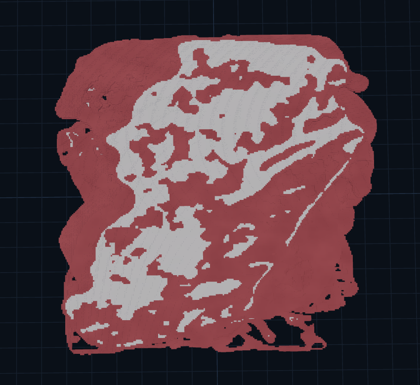
  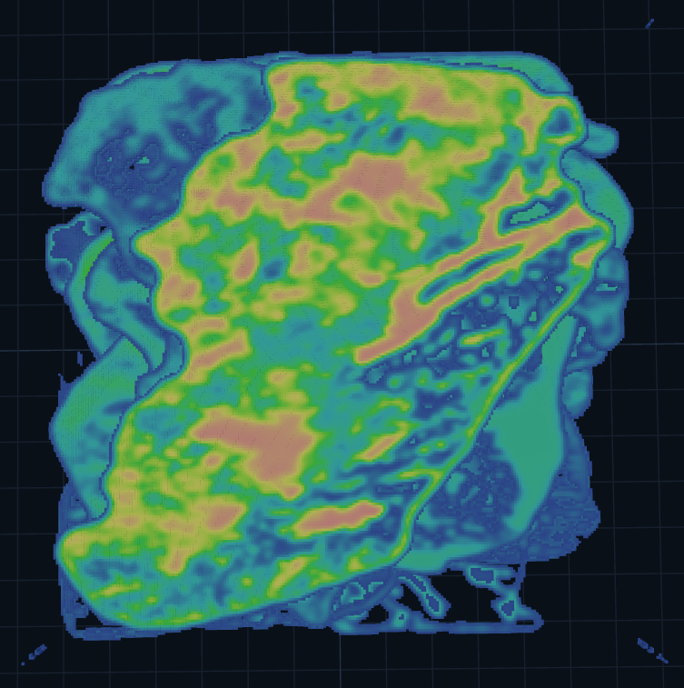
</p>
<p align="center">
  <em>왼쪽: 최종 마블링(흰색=지방 / 붉은색=근육) · 오른쪽: 같은 볼륨의 지방 확률맵 p_fat</em>
</p>

---

## 목차

- [프로젝트 개요](#프로젝트-개요)
- [핵심 개념](#핵심-개념)
- [개발 과정 (Development Journey)](#개발-과정-development-journey)
  - [1단계 · 초안 (Draft)](#1단계--초안-draft)
  - [2단계 · 절차적 알고리즘 프로토타입](#2단계--절차적-알고리즘-프로토타입)
  - [3단계 · 테스트케이스 구체화와 직접 변환](#3단계--테스트케이스-구체화와-직접-변환)
  - [4단계 · AI 학습으로의 전환](#4단계--ai-학습으로의-전환)
- [알고리즘 파이프라인](#알고리즘-파이프라인)
- [결과물](#결과물)
- [3D 뷰어](#3d-뷰어)
- [데이터셋](#데이터셋)
- [기술 스택](#기술-스택)
- [설치 및 실행](#설치-및-실행)
- [프로젝트 구조](#프로젝트-구조)
- [향후 계획 (Future Work)](#향후-계획-future-work)
- [라이선스 / 크레딧](#라이선스--크레딧)

---

## 프로젝트 개요

소고기 등심의 **마블링**은 근육 사이사이에 지방이 침투하며 만들어지는 그물(network) 구조입니다.
이 프로젝트의 목표는 그 구조를 **3차원 복셀 볼륨**으로 그럴듯하게 재현하고, 단계별로 관찰할 수 있는 **인터랙티브 뷰어**를 제공하는 것입니다.

작업은 두 갈래의 접근을 거쳤습니다.

| 접근 | 핵심 아이디어 | 한계 / 결론 |
|------|--------------|-------------|
| **A. 절차적 합성** | Voronoi / Worley / L-System / Ridged noise 등을 조합해 지방 패턴을 "만들어낸다" | 지방 시드·밀집 구조는 재현됐지만, **실제 고기 질감**까지는 도달하지 못함 |
| **B. AI 학습 기반** | 실제 한우 등심 이미지를 학습시켜 **지방 확률맵(p_fat)** 자체를 생성 | 테스트케이스가 구체적일수록 마블링이 곧바로 잘 표현됨 → **현재의 주력 방식** |

> 결론적으로, **절차적 알고리즘은 "구조의 문법"을 잡는 데** 쓰이고, **AI는 "실제 같은 분포"를 만들어내는 데** 쓰이는 형태로 정리되었습니다.

---

## 핵심 개념

- **`p_fat` (지방 확률맵)** — 각 복셀이 지방일 확률을 담은 3D 스칼라 필드. 파이프라인의 **입력(0단계)** 이자, AI가 학습해서 만들어내는 산출물.
- **복셀 볼륨 해상도** — `320 × 260 × 56` (예시 기준)
- **마블링 변환** — `p_fat`을 임계값/규칙으로 **지방 / 근육 / 결합조직(근주막)** 으로 분류
  - 예시 분포: 지방 `13.4%` · 결합조직 `1.6%` · 근육 `47.3%`

<p align="center">
  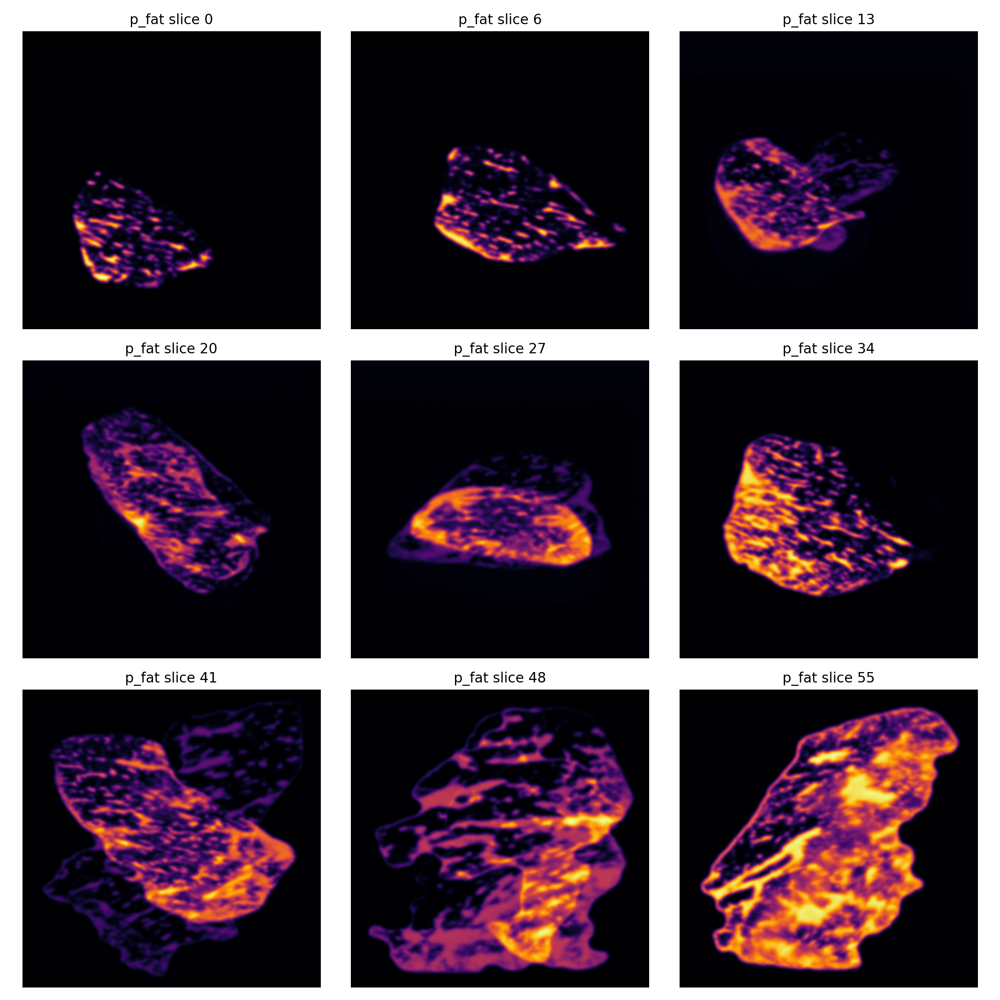
</p>
<p align="center"><em>입력 확률맵 <code>p_fat</code>을 Z축 방향으로 잘라 본 단면들 (slice 0 → 55). 밝을수록 지방 확률이 높음.</em></p>

---

## 개발 과정 (Development Journey)

> 이 섹션이 프로젝트의 핵심입니다. **"무엇을 시도했고 → 왜 한계가 있었고 → 어떻게 방향을 틀었는지"** 의 흐름으로 정리했습니다.

### 1단계 · 초안 (Draft)

처음에는 마블링 형성에 도움이 될 법한 알고리즘들을 후보로 두고 전체 파이프라인의 **밑그림**을 잡았습니다.

> 📌 _초안 알고리즘의 구체적 설계(어떤 알고리즘을 어떤 순서로, 어떤 파라미터로 조합하려 했는지)는 원본 문서에 비어 있어 채워 넣어야 합니다. → [요청 정보] 참고._

### 2단계 · 절차적 알고리즘 프로토타입

초안에서 떠올린 알고리즘들이 **정말 마블링 형성에 도움이 되는지**를 먼저 검증해야 했습니다.
그래서 **테스트케이스**를 만들어 알고리즘을 하나씩 적용해 보았습니다.

- ✅ **지방 시드(seed)** 와, 촘촘히 박혀 있는 듯한 **지방 구조**는 비슷하게 구현 가능했습니다.
- ❌ 그러나 **Voronoi · Worley · L-System** 등 다양한 알고리즘을 개선·추가해도 **"정말 고기 같은" 마블링**은 나오지 않았습니다.

<p align="center">
  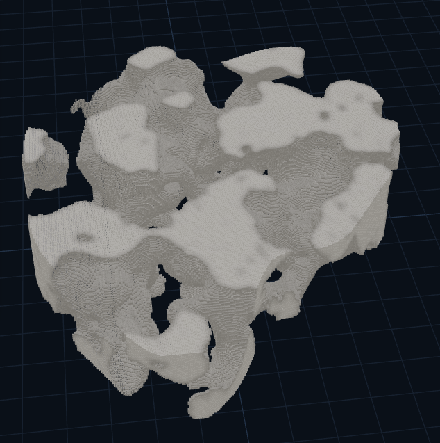
  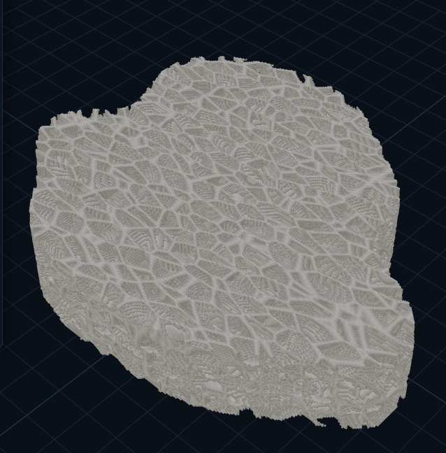
  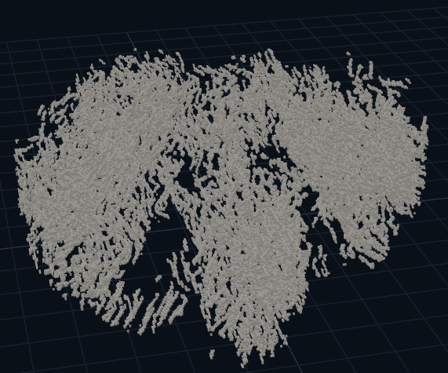
</p>
<p align="center"><em>왼쪽부터 Voronoi 영역경계 · Worley 보조 텍스처 · L-System 연결선. 구조적 패턴은 만들어지지만 실제 고기 질감과는 거리가 있었음.</em></p>

### 3단계 · 테스트케이스 구체화와 직접 변환

다음으로 **테스트케이스를 더 구체화**하고, **확률 voxel을 곧바로 지방 / 근육으로 변환**하는 방식을 시도했습니다.

그 결과 **"테스트케이스가 구체적이면 마블링이 곧바로 잘 표현·출력된다"** 는 사실을 확인했습니다.
즉, 문제는 *변환 규칙*이 아니라 **얼마나 사실적인 확률맵(`p_fat`)을 입력으로 주느냐** 였습니다.

<p align="center">
  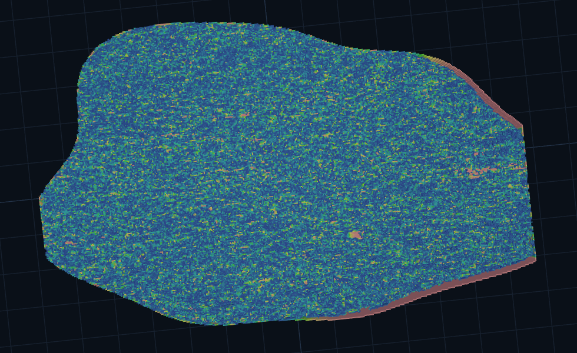
  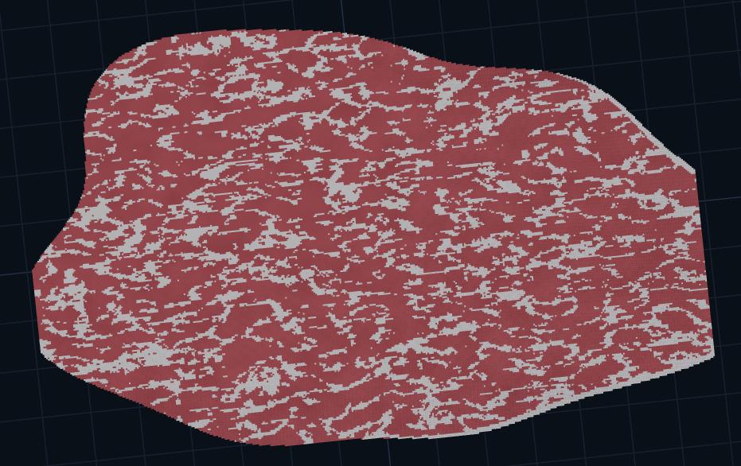
</p>
<p align="center"><em>구체적으로 다듬은 테스트 확률맵(왼쪽) → 곧바로 자연스러운 마블링으로 변환(오른쪽).</em></p>

### 4단계 · AI 학습으로의 전환

위 깨달음을 바탕으로, **사실적인 `p_fat`(feature)을 사람 손이 아니라 AI가 만들게 하자**는 방향으로 전환했습니다.

1. **AI 허브**에서 **한우 등심 1++ 등급 원본 이미지**를 수집
2. **labelme**(Anaconda 환경)로 **세그멘테이션 + 마블링 라벨링** 진행
   - 등심 세그멘테이션 이미지: **250장**
   - 마블링 라벨링 이미지: **30장**
3. **PyTorch**로 이미지를 학습시켜, 마블링 feature가 반영된 **지방 확률맵**을 생성
4. 생성된 확률맵을 마블링 변환 파이프라인에 넣어 **최종 결과물** 도출

<p align="center">
  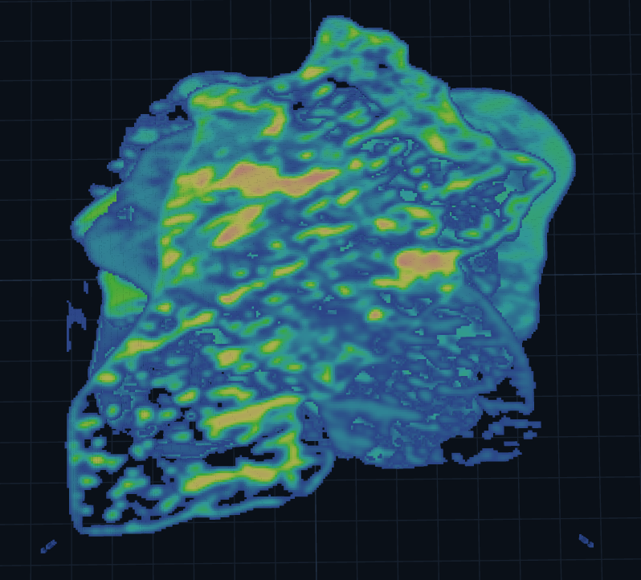
  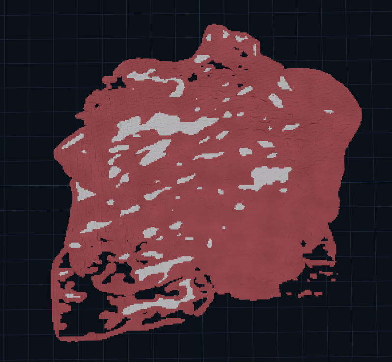
</p>
<p align="center"><em>AI가 학습해 생성한 확률맵(왼쪽)과 그로부터 변환된 마블링(오른쪽).</em></p>

---

## 알고리즘 파이프라인

뷰어의 좌측 패널은 마블링이 **단계별로 쌓여 가는 순서**를 그대로 보여 줍니다.

| # | 단계 | 역할 |
|---|------|------|
| 0 | **입력 확률맵 (`p_fat`)** | 각 복셀의 지방 확률 — 파이프라인의 입력 |
| 1 | **지방 Seed 점** | 지방이 생겨날 시드 포인트 배치 (예: 랜덤 4,000개) |
| 2 | **Seed 결방향 vein (굵은 seam)** | 시드를 결 방향으로 이어 굵은 지방 줄기(seam) 형성 |
| 3 | **Voronoi 영역경계 seam** | Voronoi 셀 경계를 따라 지방 경계선 생성 |
| 4 | **Worley 보조 텍스처** | Worley 노이즈로 미세 질감 보강 |
| 5 | **Ridged 경계 변조** | Ridged noise로 경계를 자연스럽게 변조 |
| 6 | **L-System 연결선** | L-System으로 가는 지방 연결선을 분기·성장 |
| 7 | **최종 마블링** | 위 단계를 합성한 최종 마블링 볼륨 |

<p align="center">
  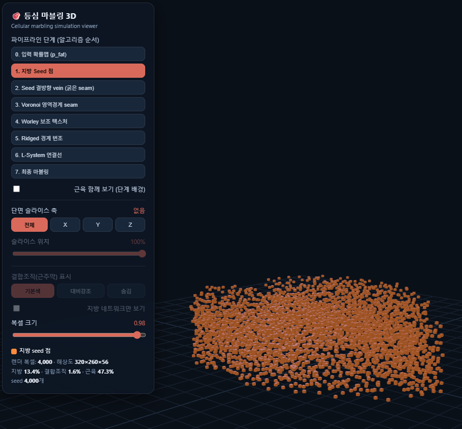
  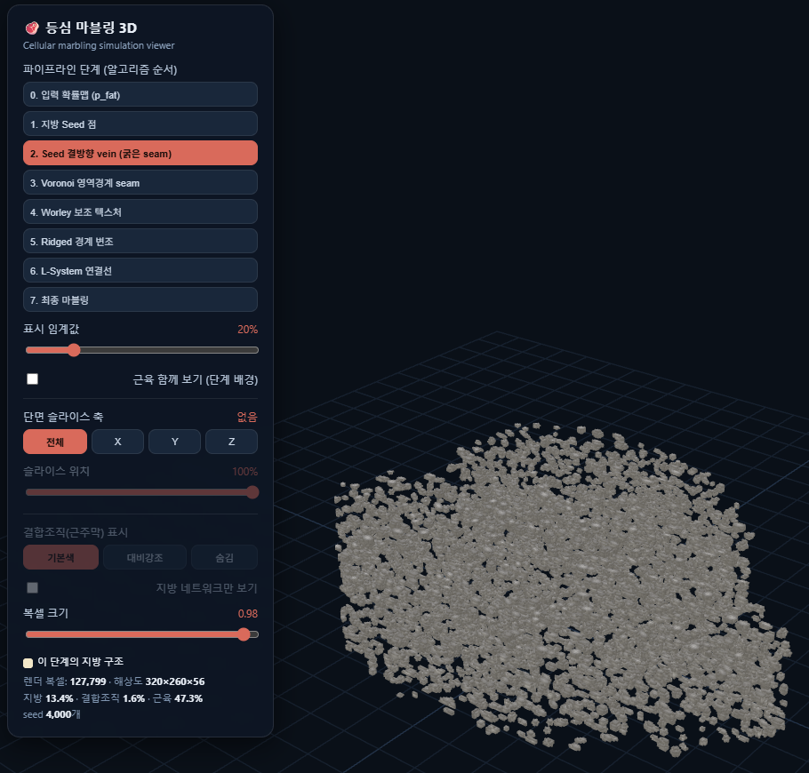
</p>
<p align="center"><em>1단계: 지방 Seed 점(좌) → 2단계: 결방향 vein으로 성장(우). 렌더 복셀 수가 4,000 → 127,799로 늘어남.</em></p>

---

## 결과물

AI 학습 기반 파이프라인으로 얻은 결과물입니다. 각 결과는 **확률맵(viridis 컬러맵)** 과 **마블링 변환(흰=지방/붉=근육)** 을 쌍으로 보여 줍니다.

<table>
  <tr>
    <td align="center"><br/><sub>확률맵 #1</sub></td>
    <td align="center"><br/><sub>마블링 #1</sub></td>
  </tr>
  <tr>
    <td align="center">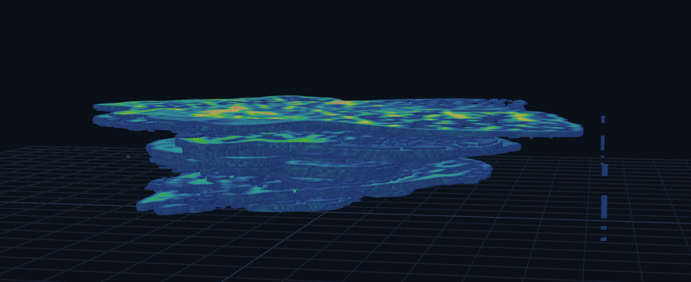<br/><sub>확률맵 #3 (측면 뷰)</sub></td>
    <td align="center">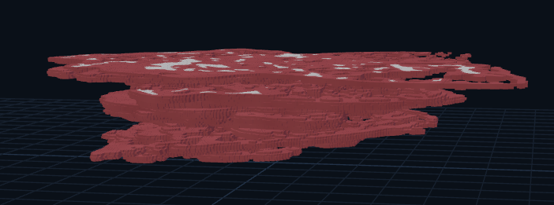<br/><sub>마블링 #3 (측면 뷰)</sub></td>
  </tr>
</table>

<p align="center">
  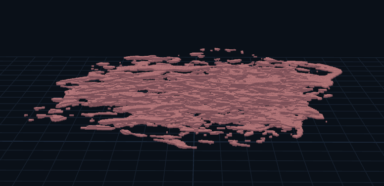
</p>
<p align="center"><em>지방 네트워크만 추출한 뷰 — 근육을 숨기고 지방의 연결 구조만 시각화.</em></p>

---

## 3D 뷰어

웹 기반 인터랙티브 뷰어 **"등심 마블링 3D — Cellular marbling simulation viewer"** 가 포함되어 있습니다.

주요 기능:

- **파이프라인 단계 토글** — 0~7단계를 눌러 각 알고리즘이 더해지는 과정을 관찰
- **단면 슬라이스** — X / Y / Z 축으로 볼륨을 잘라 내부 단면 확인 (슬라이스 위치 0~100%)
- **결합조직(근주막) 표시** — 기본색 / 대비강조 / 숨김
- **지방 네트워크만 보기** — 근육을 숨기고 지방 구조만 렌더
- **복셀 크기 / 표시 임계값** 조절
- 실시간 통계 — 렌더 복셀 수, 해상도, 지방·결합조직·근육 비율 표시

> 📌 _뷰어의 프레임워크/렌더러(예: Three.js, WebGL 등)와 빌드 방식은 [요청 정보]에서 확정해 채워 넣습니다._

---

## 데이터셋

- **출처:** AI 허브 — 한우 등심 1++ 등급 원본 이미지
- **세그멘테이션 이미지:** 250장
- **마블링 라벨링 이미지:** 30장
- **라벨링 도구:** [labelme](https://github.com/wkentaro/labelme) (Anaconda 환경)

> 📌 _데이터셋 정확한 명칭/링크와 재배포 가능 여부는 [요청 정보]에서 확인이 필요합니다 (AI 허브 데이터는 보통 직접 재배포가 제한됩니다)._

---

## 기술 스택

| 영역 | 사용 기술 |
|------|-----------|
| 머신러닝 | PyTorch |
| 데이터 라벨링 | labelme, Anaconda |
| 절차적 생성 | Voronoi, Worley noise, L-System, Ridged noise |
| 3D 시각화 | 웹 기반 복셀 뷰어 _(렌더러 확정 필요)_ |

> 📌 _언어/프레임워크 버전, 정확한 모델 아키텍처(예: U-Net 계열 세그멘테이션 등)는 [요청 정보] 참고._

---

## 프로젝트 구조

> 📌 _실제 디렉터리 구조에 맞게 수정해 주세요._

```
.
├── data/                # 등심 이미지 · 라벨 (재배포 가능한 경우)
├── labeling/            # labelme 작업물 (.json 등)
├── model/               # PyTorch 학습/추론 코드
│   ├── train.py
│   └── infer.py
├── pipeline/            # p_fat → 마블링 변환 (Voronoi/Worley/L-System ...)
├── viewer/              # 3D 인터랙티브 뷰어
├── assets/              # README용 이미지
└── README.md
```

---

## 향후 계획 (Future Work)

향후 작업은 **① 라벨링 도구 고도화**, **② 데이터 일관성 확보**, **③ 산업적 확장**의 세 축으로 진행합니다.

### 1. 라벨링 도구 전환 — labelme → ilastik

기존에는 [labelme](https://github.com/wkentaro/labelme)로 마블링 경계를 **수작업 폴리곤**으로 그렸습니다.
그러나 마블링은 가늘고 분기가 많은 **그물형 미세 구조**라서, 폴리곤을 일일이 따라 그리는 방식은 시간이 오래 걸리고 일관성이 떨어졌습니다.
이를 개선하기 위해 **대화형 머신러닝 기반 분할 도구인 [ilastik](https://www.ilastik.org/)** 으로 전환합니다.

| 항목 | labelme | **ilastik** |
|------|---------|-------------|
| 방식 | 사람이 경계를 직접 그리는 **수동 폴리곤 주석** | 몇 번의 브러시 스트로크로 학습하는 **대화형 픽셀 분류** |
| 입력 라벨 | 객체마다 전체 경계를 그려야 함 | 일부 영역만 칠하는 **희소(sparse) 라벨** |
| 특징(feature) | 없음 (전적으로 수동) | **다중 스케일 텍스처·엣지·강도 특징**을 자동 학습 |
| 출력 | 폴리곤 좌표(JSON) / 이진 마스크 | 픽셀별 클래스 + **확률맵(probability map)** |
| 일반화 | 이미지마다 처음부터 반복 | 학습된 분류기를 **다른 이미지에 그대로 적용** |
| 적합한 대상 | 경계가 뚜렷한 객체 인스턴스 | **복잡한 텍스처·미세 구조** |

**ilastik이 마블링 라벨링에 가지는 장점**

- **미세·분기 구조에 강함** — 지방 결을 일일이 그리지 않고, 지방/근육 영역을 몇 번만 칠해주면 텍스처·엣지 특징을 학습해 나머지를 자동 분류합니다.
- **확률맵을 직접 출력** — ilastik의 출력이 곧 픽셀별 지방 확률맵이라, 본 프로젝트의 핵심 입력인 **`p_fat`과 자연스럽게 연결**됩니다. (수동 마스크 → 확률맵 변환 단계 불필요)
- **라벨링 속도·일관성 향상** — 분류기를 한 번 학습하면 다수 이미지에 일괄 적용되어, 250장 규모에서도 작업 시간이 크게 줄고 사람마다 달라지는 주관적 편차가 감소합니다.
- **경계의 점진적 표현** — 지방과 근육이 섞이는 모호한 경계를 0~1 확률로 부드럽게 표현해, 폴리곤의 딱딱한 경계보다 실제 마블링에 가깝습니다.

### 2. 데이터 일관성 확보 — 단일 대형 덩어리 사용

현재 학습에 사용한 이미지들은 **서로 다른 고기 덩어리에서 촬영**된 것이라, 단면의 크기와 스케일이 제각각입니다.
이렇게 픽셀당 실제 크기(scale)가 표본마다 다르면, 모델이 마블링의 **굵기·간격을 일관되게 학습하기 어렵고** 결과물의 품질 편차로 이어집니다.

이를 상쇄하기 위해, 앞으로는 **하나의 큰 덩어리 고기를 사용**해 동일한 조건·스케일에서 다수의 단면을 확보할 계획입니다.
이를 통해

- 표본 간 **스케일·조명·촬영 조건을 통일**하고,
- 동일 개체에서 연속 단면을 얻어 **3D 볼륨 재구성의 정합성**을 높이며,
- 모델이 **일관된 feature 분포**를 학습하도록 합니다.

### 3. 기대 효과 및 활용 분야

#### 해결하려는 핵심 문제

기후 변화와 식량 자원 문제로 **배양육(cultured meat)** 은 차세대 식품 산업으로 주목받고 있지만,
현재 기술은 한우·와규 수준의 **정교한 마블링 구조를 재현하지 못합니다.**
대부분의 배양육은 근육과 지방을 **단순 혼합하거나 층층이 출력**하는 방식이라, 실제 고기처럼 근육 사이로 지방이 얇고 복잡하게 퍼진 **3차원 네트워크 구조**를 만들지 못합니다.

실제 고급육의 식감과 풍미는 지방의 **양**만이 아니라 **위치 · 연결성 · 방향성 · 가지 구조 · 근육 결 방향**이 복합적으로 작용해 결정됩니다.
본 프로젝트는 실제 소고기 단면을 AI로 분석해 이 구조를 **디지털 3D 공간에서 먼저 설계·생성**함으로써, 세포 배양 이전 단계에서 "목표 조직 구조"를 정의할 수 있게 합니다.

#### 주요 활용 분야

- **배양육 조직 설계 (핵심 타깃)**
  배양육 연구에서 "어떤 마블링을 목표로 배양할 것인가"를 정의하는 **target structure 참조 모델**로 활용됩니다. 세포 배양·바이오프린팅 *이전* 단계에서 디지털로 조직을 설계해, 시행착오와 비용을 줄입니다.

- **3D 바이오프린팅 구조 설계**
  voxel 기반 3차원 구조는 바이오프린팅의 **출력 타깃(target structure)** 으로 직접 연결됩니다. 지방·근육의 3차원 배치를 좌표 단위로 지정할 수 있어, 단순 적층을 넘어 실제 같은 마블링 출력을 지향할 수 있습니다.

- **Digital Twin 기반 조직 시뮬레이션**
  실제 조직의 디지털 트윈을 구축해, 성장 파라미터(지방 밀도·방향성·연결성 등)를 바꿔가며 **조직 형성 과정을 가상 실험**하는 연구로 확장 가능합니다.

- **AI 기반 품질 등급 판정 · 데이터 증강**
  1++ 같은 고등급 데이터는 비싸고 희소합니다. 합성 마블링으로 **학습 데이터를 대량 보강**하고, 사람 눈에 의존하던 평가를 **정량 지표(지방 비율·연결성·가지 두께·군집 크기·방향성·밀도)** 기반으로 객관화합니다.

- **식감·조직 분석 시뮬레이션**
  마블링의 3차원 분포를 바탕으로 식감·조직 특성을 분석·예측하는 연구의 기반 데이터로 활용됩니다.

#### 기대 효과

**🌱 사회적**

- 지속 가능한 식량 생산 기술 발전에 기여
- 배양육 연구에 **디지털 시뮬레이션 기반**을 제공
- AI 기반 식품 연구 분야 확장 및 **식품 바이오 × 컴퓨터공학 융합 연구** 활성화

**💰 경제적**

- 배양육 기업의 **조직 설계 비용 절감**
- 고급육 품질 분석·시뮬레이션 산업으로 확장
- **3D 바이오프린팅용 target structure 데이터** 공급
- AI 기반 축산 데이터 산업과의 연계

**⚙️ 기술적**

- 실제 소고기와 유사한 **3차원 마블링 생성 모델** 구축
- **procedural generation 기반 조직 생성 기술** 연구 토대 마련
- Digital Twin 기반 조직 시뮬레이션으로 확장 가능

> 본 프로젝트는 단순 시각적 생성이 아니라, **정량적 비교가 가능한 조직 생성 모델**을 지향합니다.
> (지방 비율 · 연결성 · 가지 두께 분포 · 군집 크기 · 방향성 분포 · 마블링 밀도 등으로 실제 소고기와의 유사도 평가)

#### 주요 대상

배양육 연구 기업 · 식품 바이오 연구소 · AI 기반 식품 분석 연구기관 · 3D 바이오프린팅 연구팀 · 축산 데이터 연구기관

